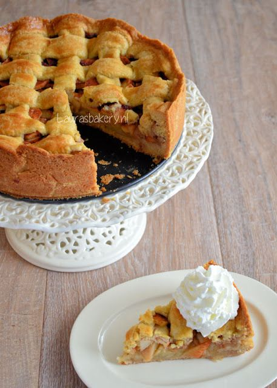

# Appel taart zoals die van oma

## Benodigdheden

*-* 200 gram ongezouten roomboter
*-* 200 gram witte bastard suiker
*-* 400 gram zelfrijzend bakmeel
*-* 1 ei
*-* 8 gram vanille suiker
*-* snuf zout
*-* 1,5 kilo zoet zure appels
*-* 75 gram kristal suiker
*-* 3tl kaneel
*-* 15 gram paneermeel

### Bereiding

1. Klop het ei los verdeel in twee delen. De ene is voor het deeg, de ander voor het bestrijken.
2. Meng boter, basterdsuiker, zelfrijzend bakmeel, het halve ei, vanillesuiker en een snufje zout tot een stevig deeg en verdeel in 3 delen.
3. Schil nu de appels en snij deze in plakjes. Vermeng in een kopje de suiker met kaneel.
4. Vet de springvorm in en bestuif met bloem.
5. Gebruik één deel deeg om de bodem van de vorm mee te bedekken. Een tweede deel deeg gebruik je voor de randen. Strooi het paneermeel op de bodem van de beklede vorm. De paneermeel neemt het vocht van de appels op.
6. Doe de helft van de appels in de vorm en strooi hier 1/3 van het kaneel-suiker mengsel overheen. De overige appelschijfjes kun je nu ook in de vorm doen, strooi de rest van het kaneel-suiker mengsel erover.
7. Rol het laatste deel deeg uit tot een dunne lap en snij stroken van ongeveer 1 cm breed.
8. Leg de stroken kruislings  op de appeltaart. Met wat extra deegstroken werk je de rand rondom af. Gebruik het halve ei om de stroken in te smeren.
9. Zet de taart iets onder het midden van de oven. Bak in 60 minuten op 170 °C (boven- en onderwarmte) gaar en goudbruin.
10. Laat de taart afkoelen in de vorm voordat je de ring verwijdert.
11. Nog een klein beetje warm met een toef slagroom is deze taart heel erg lekker. Maar de volgende dag is hij eigenlijk nóg lekkerder, als de smaken lekker zijn doorgetrokken.

Link naar het recept [Laurasbakery](https://www.laurasbakery.nl/omas-appeltaart/)
